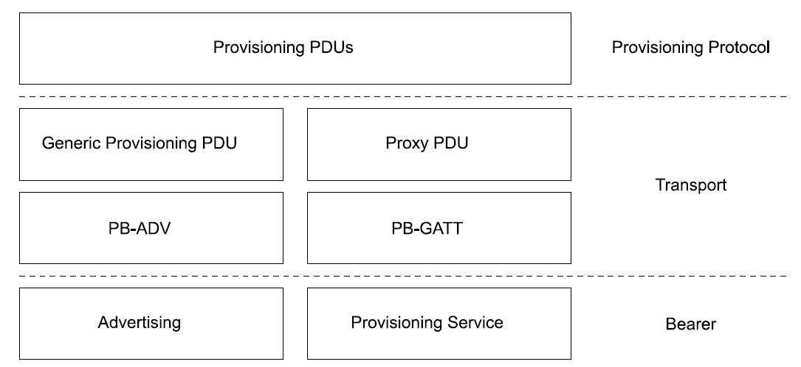

# 入网

**入网(Provisioning)是将未入网设备(unprovisioned device)加入到一个mesh网络的过程**，是通过一个**provisioner**实现的。provisioner向未入网设备提供允许该设备成为网络中节点的入网信息。**入网信息包括network key，当前IV Index，以及每个元素的unicast address**。

provisioner通常是智能手机或者其他移动端处理设备。尽管网络只要求一个provisioner负责入网工作，但是网络中允许多个provisioner存在。在多个provisioner中共享缓存数据和协调的方法是特定于实现的。

**为将目标设备入网，在provisioner和设备之间必须先建立provisioning bearer**。provisioner可以通过目标设备的Device UUID和所提供的其他补充信息来认证目标设备。

在provisioning bearer建立起来之后，provisioner根据ECDH(Elliptic Curve Diffie-Hellman)协议与目标设备之间建立共享secret。然后，provisioner根据特定于设备的OOB信息对目标设备进行认证。上述OOB信息可能包含公用秘钥，一个长secret，将值输入设备的请求，从目标设备输出数值的请求等。以上OOB信息使能对目标设备的认证。一旦设备通过认证，provisioner通过共享secret生成的秘钥对入网信息进行加密并发送给目标设备。device key是根据ECDHSecret和ProvsioningSalt计算出来的。

入网过程使用分层结构，如<mark style="background-color:green;">provisioning协议栈</mark>所示。目标设备的入网过程通过发送provisiong PDU的入网协议实现。provisioner使用Generic Provisioning层或者Proxy协议层向未入网的目标设备发送Provisioning PDU。这两层定义了Provisioning PDU如何在传输过程中分段和重组。上述传输是在provisioning bearer上传输的。provisioning bearer定义了从Generic Provisioning层传向单个目标设备的会话是如何建立起来的。最后，在入网协议栈架构的底层是Bearer层。

